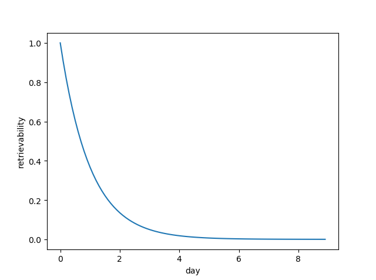
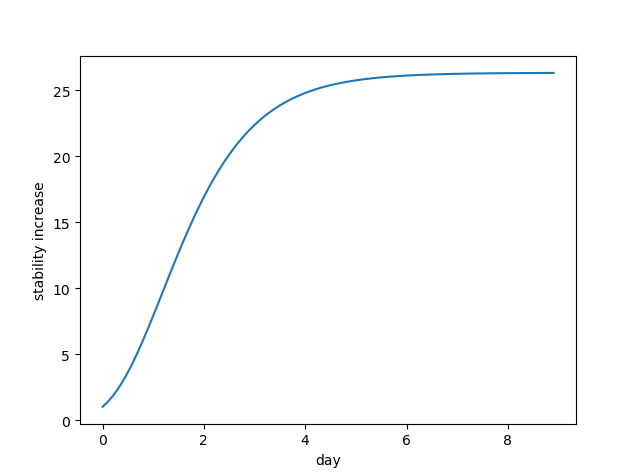

# UnforgettableMemo

📒 A memo APP that shows memos based on memory decay theory. 🧠 Least time for more remembering tasks! ⚡

## Features

-   It only shows **the least remembered memo**.
-   **The window pops up** when there is a memo somewhat **forgotten**.
-   The memo saves when the text is changed.
-   The window could not be deactivated but could be covered by other windows if every memo has not been forgotten.
-   When the review button (✔️) is clicked, the memory status updates.
-   Every 30 min the displaying memo is swapped to the least remembered one.

## How to Use

-   Write a memo in the middle textbox.
-   Click the top-left "+" button to add a new memo
-   Memos are saved in realtime.
-   Click the bottom-left "✔️" button to review the displaying memo and swap to the other least remembered memo.
-   Click the bottom-left "🗑" button to remove the displaying memo.
-   Click the top-right "🔄" button to swap to the other least remembered memo.
-   Click the top-right "X" button to permanently close the application.

## Install Desktop Client

1. Download the executable from the release page
1. Schedule a startup for the executable

## Memory Decay Theory

The logic is based on the forgetting curve, mainly from this website <https://supermemo.guru/wiki/Forgetting_curve>.

> Forgetting curve describes the decline in the probability of recall over time:
>
> $$
> R = exp ^ {-t / S}
> $$
>
> where:
>
> R - probability of recall (retrievability of memory)
>
> S - strength of a memory trace (stability of memory)
>
> t - time

> The formula for the stabilization curve:
>
> $$
> SInc = SInc_{Max} * e ^ {-Gain * R}
> $$
>
> where:
>
> SInc: stabilization (aka stability increase) is the ratio of memory stability after and before the repetition
>
> SIncMax: maximum possible increase in memory stability. SIncMax depends on current stability and memory complexity (i.e. item difficulty). Maximum stabilization can be achieved at the verge of forgetting
>
> Gain: a constant that expresses the gain in stabilization with passing time (gain is a measure of the spacing effect)
>
> R: retrievability, i.e. the expected probability of recall at a given point in time. It is determined by the forgetting curve

## Recommended Usage

-   Recite vocabularies

## Memo Persistence

Logic goes [here](src/UnforgettableMemo.Shared/Data).

For fast development, the memos are currently stored as JSON.

## TODO

-   [ ] Support social media bot
-   [ ] Sync on cloud
